# Bitcoin Price Streamer - Architecture Plan

## Executive Summary

The Bitcoin Price Streamer is a real-time web application that provides live Bitcoin price updates to browser clients using Server-Sent Events (SSE). The system polls the CoinGecko public API every 5 seconds for current BTC/USD pricing data and streams updates to connected clients every second. The current implementation is a lightweight proof-of-concept built with Flask, focusing on demonstrating real-time streaming capabilities.

**Key Characteristics:**
- Real-time price streaming using Server-Sent Events (SSE)
- Background polling of third-party cryptocurrency price API
- Single-page web interface with minimal UI
- Currently in MVP/prototype stage with opportunities for production hardening

This architecture document analyzes the current system, identifies areas for improvement, and provides a phased approach to evolving from the current MVP to a production-ready architecture.

---

## System Context

### System Context Diagram

```mermaid
graph TB
    subgraph "External Systems"
        CoinGecko[CoinGecko API<br/>api.coingecko.com]
    end
    
    subgraph "Bitcoin Price Streamer System"
        BPS[Bitcoin Price<br/>Streamer Application]
    end
    
    subgraph "Users"
        WebUser[Web Browser Users]
    end
    
    WebUser -->|HTTP/SSE Requests| BPS
    BPS -->|Real-time Price Stream<br/>SSE| WebUser
    BPS -->|Poll BTC Price<br/>Every 5s| CoinGecko
    CoinGecko -->|JSON Response<br/>Price Data| BPS
    
    style BPS fill:#0f1724,stroke:#4a9eff,stroke-width:3px
    style CoinGecko fill:#2d3748,stroke:#68d391
    style WebUser fill:#2d3748,stroke:#68d391
```

### Explanation

**Overview:**
The System Context Diagram shows the Bitcoin Price Streamer application and its interactions with external entities. The system sits between end users (web browser clients) and the CoinGecko API service.

**Key Components:**
1. **Web Browser Users**: End users accessing the application through standard web browsers
2. **Bitcoin Price Streamer Application**: The core Flask-based application that orchestrates data fetching and streaming
3. **CoinGecko API**: Third-party REST API providing cryptocurrency pricing data

**Relationships:**
- Users initiate HTTP requests to load the web interface and establish SSE connections for real-time updates
- The application independently polls CoinGecko every 5 seconds regardless of connected clients
- Price data flows from CoinGecko → Application → Users through an asynchronous streaming pattern

**Design Decisions:**
- **SSE over WebSockets**: Chosen for simplicity as communication is unidirectional (server → client)
- **CoinGecko Public API**: Free tier suitable for proof-of-concept; no API key required
- **Polling Strategy**: Fixed 5-second interval balances freshness with API rate limits

**NFR Considerations:**
- **Scalability**: Current design has limitations with shared state; needs improvement for production
- **Performance**: Lightweight SSE protocol minimizes bandwidth; 1-second client updates provide smooth UX
- **Security**: Currently minimal; requires HTTPS, authentication, and rate limiting for production
- **Reliability**: Single point of failure; no redundancy or error recovery mechanisms
- **Maintainability**: Simple architecture is easy to understand but lacks monitoring and observability

---

## Architecture Overview

The Bitcoin Price Streamer follows a **simple three-tier architecture** pattern:

1. **Presentation Layer**: Static HTML/CSS/JavaScript served to browsers
2. **Application Layer**: Flask web server with background threading for data fetching
3. **Integration Layer**: HTTP client for third-party API communication

**Architectural Patterns Used:**
- **Producer-Consumer Pattern**: Background thread produces price data; SSE endpoints consume and stream it
- **Shared State Pattern**: In-memory dictionary for inter-thread communication
- **Event Streaming Pattern**: Server-Sent Events for real-time data push

**Current Architecture Style:** Monolithic web application with embedded background worker

---

## Component Architecture

### Component Diagram

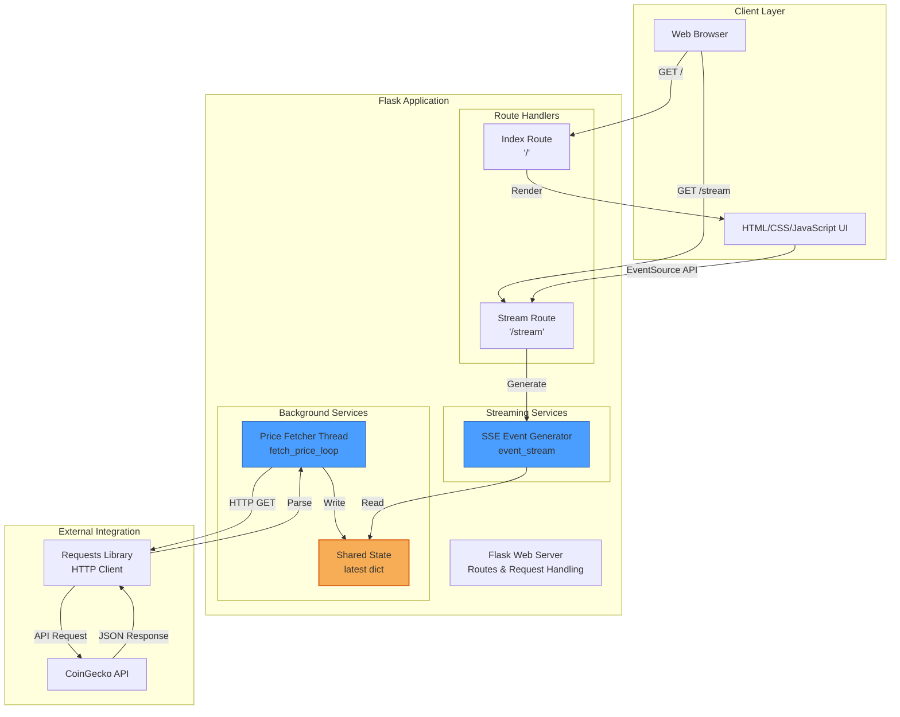

### Detailed Explanation

**Key Components:**

1. **Web Browser & UI**
   - **Responsibility**: Render user interface and establish SSE connection
   - **Technology**: HTML5, CSS3, JavaScript (EventSource API)
   - **Key Functions**: Display formatted price, handle connection status, format timestamps

2. **Flask Web Server**
   - **Responsibility**: HTTP request routing, response generation, template rendering
   - **Technology**: Flask 2.0+, Jinja2 templates
   - **Key Functions**: Serve static content, manage SSE connections, coordinate components

3. **Route Handlers**
   - **Index Route ('/')**: Serves the main HTML page with UI
   - **Stream Route ('/stream')**: Establishes SSE connection and streams price updates
   - **Technology**: Flask decorators and view functions

4. **Price Fetcher Thread**
   - **Responsibility**: Continuously poll CoinGecko API for Bitcoin price
   - **Technology**: Python threading, requests library
   - **Polling Interval**: 5 seconds
   - **Error Handling**: Silent failure with previous value retention
   - **Key Functions**: HTTP GET to API, JSON parsing, state updates

5. **Shared State**
   - **Responsibility**: In-memory storage for latest price data
   - **Technology**: Python dictionary (not thread-safe by default)
   - **Data Structure**: `{"price": float, "time": timestamp}`
   - **Access Pattern**: Write from fetcher thread, read from SSE generator

6. **SSE Event Generator**
   - **Responsibility**: Generate server-sent event stream for clients
   - **Technology**: Python generator function
   - **Stream Interval**: 1 second
   - **Format**: `data: {JSON}\n\n` as per SSE specification

7. **HTTP Client**
   - **Responsibility**: Make HTTP requests to CoinGecko API
   - **Technology**: requests library
   - **Timeout**: 10 seconds
   - **Error Handling**: Exception catching with status code validation

**Component Relationships:**

- **Price Fetcher ↔ Shared State**: Write-only relationship; updates every 5 seconds
- **SSE Generator ↔ Shared State**: Read-only relationship; accesses every 1 second
- **Flask Routes ↔ Generators**: Stream route wraps generator as Response object
- **Browser ↔ Flask**: HTTP request/response with persistent SSE connection

**Design Decisions:**

1. **Threading vs Async/Await**: Threading chosen for simplicity; async could improve scalability
2. **Shared Dictionary**: Simple but not thread-safe; acceptable for single-writer scenario
3. **SSE vs WebSocket**: SSE sufficient for unidirectional streaming; lower complexity
4. **Daemon Thread**: Fetcher thread marked as daemon to allow clean shutdown

**NFR Considerations:**

- **Scalability**: 
  - ⚠️ Shared state doesn't scale across multiple processes
  - ⚠️ Each client connection holds an active generator
  - ✅ SSE is efficient for one-way communication
  
- **Performance**:
  - ✅ Lightweight JSON payloads
  - ✅ Minimal processing per request
  - ⚠️ No caching strategy implemented
  
- **Security**:
  - ⚠️ No authentication on stream endpoint
  - ⚠️ No rate limiting for connections
  - ⚠️ No input validation
  - ⚠️ Silent exception handling could hide security issues
  
- **Reliability**:
  - ⚠️ No retry logic for API failures
  - ⚠️ Single point of failure
  - ⚠️ No health checks
  - ✅ Graceful degradation (keeps previous value on API failure)
  
- **Maintainability**:
  - ✅ Simple, readable code
  - ⚠️ No logging or monitoring
  - ⚠️ No structured error handling
  - ✅ Clear separation of concerns

**Trade-offs:**

- **Simplicity vs Robustness**: Prioritized quick development over production features
- **In-Memory vs Distributed State**: No persistence layer keeps it lightweight but limits scaling
- **Fixed Intervals vs Dynamic**: Simpler implementation but less efficient resource usage

---

## Deployment Architecture

### Deployment Diagram - Current (Phase 1: MVP)

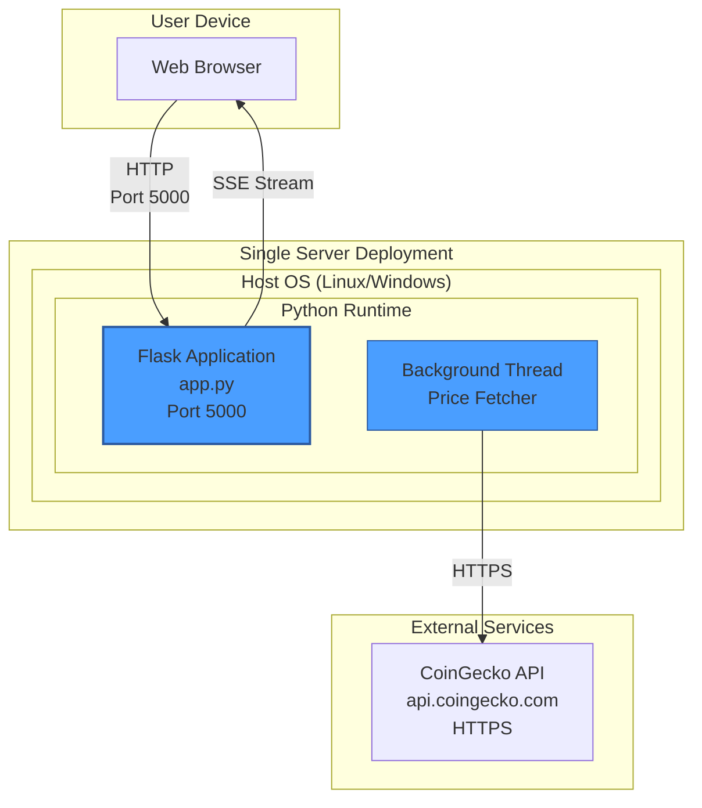

### Deployment Diagram - Recommended (Phase 2: Production)

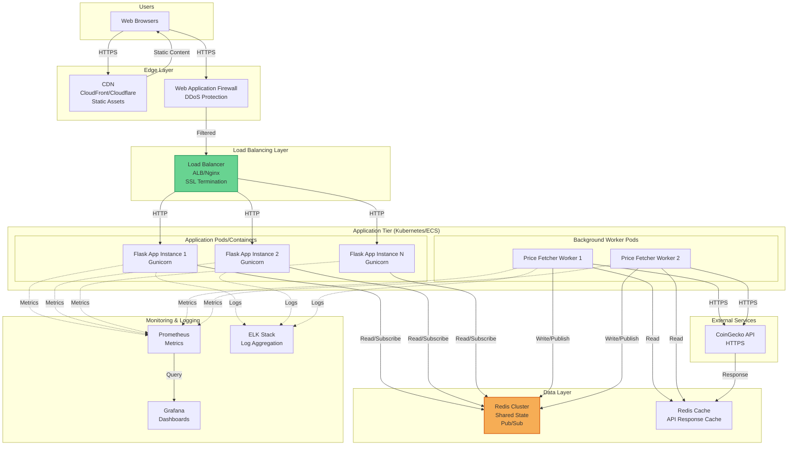

### Detailed Explanation

**Phase 1: MVP Deployment (Current)**

**Overview:**
The current deployment is a single-process Flask application running the built-in development server on a single host.

**Infrastructure Components:**
1. **Host Server**: Single VM or bare metal server
2. **Python Runtime**: Python 3.7+ interpreter
3. **Flask Development Server**: Built-in WSGI server (not production-grade)
4. **Single Process**: All components (web server + background thread) in one process

**Characteristics:**
- ✅ Simple to deploy and run
- ✅ Minimal infrastructure requirements
- ✅ Easy to debug and develop
- ⚠️ Not suitable for production use
- ⚠️ No SSL/TLS encryption
- ⚠️ No high availability
- ⚠️ Limited to single-core performance
- ⚠️ No load distribution

**Deployment Steps:**
1. Install Python 3.7+
2. Install dependencies: `pip install -r requirements.txt`
3. Run: `python app.py`
4. Access: `http://localhost:5000`

**Phase 2: Production Deployment (Recommended)**

**Overview:**
A production-grade deployment using container orchestration, distributed state management, and comprehensive monitoring.

**Infrastructure Components:**

1. **Edge Layer**
   - **CDN**: Serve static assets (HTML, CSS, JS) with low latency globally
   - **WAF**: Protect against DDoS, SQL injection, XSS attacks
   - **Purpose**: Security and performance at the edge

2. **Load Balancing Layer**
   - **Technology**: AWS ALB, Azure Load Balancer, or Nginx
   - **Features**: SSL termination, health checks, session affinity
   - **Purpose**: Distribute traffic, handle SSL, improve availability

3. **Application Tier**
   - **Container Orchestration**: Kubernetes or AWS ECS
   - **Application Pods**: Multiple Flask instances behind Gunicorn WSGI server
   - **Horizontal Scaling**: Auto-scaling based on CPU/memory/connection count
   - **Health Checks**: Liveness and readiness probes
   - **Resource Limits**: CPU and memory constraints per pod

4. **Background Workers**
   - **Separate Pods**: Dedicated containers for price fetching
   - **Redundancy**: Multiple workers for reliability
   - **Leader Election**: Ensure only one active fetcher to avoid API rate limits
   - **Retry Logic**: Exponential backoff for API failures

5. **Data Layer**
   - **Redis Cluster**: Distributed state management
     - Pub/Sub pattern for price updates
     - Shared cache for consistent data across instances
     - High availability with replica sets
   - **API Response Cache**: Reduce external API calls
     - TTL: 4-5 seconds to align with polling interval
     - Fallback mechanism if cache misses

6. **Monitoring & Logging**
   - **Prometheus**: Metrics collection (request rates, latencies, errors)
   - **ELK Stack**: Centralized logging and search
   - **Grafana**: Visualization and alerting dashboards
   - **Custom Metrics**: Price update frequency, API success rate, client connections

**Network Architecture:**
- **Security Groups/Firewalls**: Restrict traffic between layers
- **Private Subnets**: Application and data layers not directly exposed
- **Public Subnets**: Load balancer and CDN endpoints only
- **VPC/VNET**: Isolated network for all components

**Design Decisions:**

1. **Separate Application and Workers**: 
   - **Rationale**: Different scaling requirements; workers need fewer instances
   - **Benefit**: Optimize resource usage and costs

2. **Redis for State Management**:
   - **Rationale**: Fast, supports pub/sub, horizontally scalable
   - **Alternative**: PostgreSQL with NOTIFY/LISTEN (more durable but slower)

3. **Container Orchestration**:
   - **Rationale**: Simplified deployment, scaling, and management
   - **Alternative**: VM-based deployment (higher overhead)

4. **CDN for Static Assets**:
   - **Rationale**: Reduce origin server load, improve global performance
   - **Cost**: Low for small static files

**NFR Considerations:**

- **Scalability**:
  - ✅ Horizontal scaling of application instances
  - ✅ Auto-scaling based on metrics
  - ✅ Distributed state management
  - ✅ Can handle thousands of concurrent SSE connections

- **Performance**:
  - ✅ CDN reduces latency for static assets
  - ✅ Load balancer distributes traffic efficiently
  - ✅ Redis provides microsecond latency for state access
  - ✅ Caching reduces external API calls

- **Security**:
  - ✅ SSL/TLS encryption (HTTPS)
  - ✅ WAF protects against common attacks
  - ✅ Network segmentation and security groups
  - ✅ Secrets management (environment variables or vault)
  - ⚠️ Still needs authentication and authorization

- **Reliability**:
  - ✅ Multiple application instances (no single point of failure)
  - ✅ Health checks and auto-recovery
  - ✅ Redis replication for data durability
  - ✅ Graceful degradation (cache fallback)
  - ✅ Circuit breaker pattern for external API

- **Maintainability**:
  - ✅ Comprehensive monitoring and alerting
  - ✅ Centralized logging for troubleshooting
  - ✅ Infrastructure as Code (Terraform/CloudFormation)
  - ✅ Blue-green or canary deployments
  - ✅ Container images for consistent deployments

**Deployment Environments:**

1. **Development**: Single container, local Redis, mock API
2. **Staging**: Scaled-down production (2 app instances, 1 worker)
3. **Production**: Full deployment with auto-scaling

**Cost Considerations:**
- **MVP**: $5-10/month (single small VM)
- **Production**: $200-500/month (AWS: ALB, ECS, ElastiCache, CloudWatch)
- **Optimization**: Use spot instances for workers, reserved instances for baseline capacity

---

## Data Flow

### Data Flow Diagram

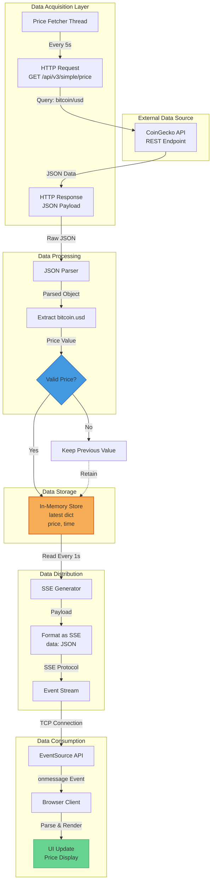

### Detailed Explanation

**Overview:**
The data flow diagram illustrates how Bitcoin price data moves through the system from external source to user display, including all transformations, validations, and storage points.

**Data Flow Stages:**

**1. Data Acquisition (Every 5 seconds)**

**Source**: CoinGecko Public API
- **Endpoint**: `https://api.coingecko.com/api/v3/simple/price`
- **Method**: HTTP GET
- **Parameters**: `ids=bitcoin&vs_currencies=usd`
- **Timeout**: 10 seconds
- **Authentication**: None (public API)

**Request Format**:
```
GET /api/v3/simple/price?ids=bitcoin&vs_currencies=usd HTTP/1.1
Host: api.coingecko.com
```

**Response Format**:
```json
{
  "bitcoin": {
    "usd": 43250.67
  }
}
```

**2. Data Processing**

**Parsing Stage**:
- Input: Raw JSON string from HTTP response
- Process: `response.json()` - deserialize JSON to Python dict
- Output: Python dictionary object

**Extraction Stage**:
- Input: Parsed JSON object
- Process: Navigate structure `data["bitcoin"]["usd"]`
- Output: Float value representing price in USD
- Error Handling: Returns None if keys don't exist

**Validation Stage**:
- Check: Is price a valid number (not None)?
- Success Path: Store new price with timestamp
- Failure Path: Retain previous price value
- Rationale: Graceful degradation prevents UI showing errors

**3. Data Storage**

**Storage Medium**: In-memory Python dictionary
- **Structure**: `{"price": 43250.67, "time": 1701234567.89}`
- **Access Pattern**: Single writer (fetcher), multiple readers (SSE generators)
- **Consistency**: Eventually consistent (1-second lag maximum)
- **Persistence**: None - data lost on restart
- **Concurrency**: Not explicitly thread-safe but acceptable due to single writer

**Data Characteristics**:
- **Volume**: 2 fields, ~50 bytes per update
- **Velocity**: Updates every 5 seconds
- **Variety**: Single structured data type
- **Veracity**: Subject to API reliability

**4. Data Distribution (Every 1 second)**

**SSE Generation**:
- Trigger: Timer-based (1-second intervals)
- Source: Read from shared memory store
- Format: Server-Sent Event protocol

**SSE Payload Structure**:
```
data: {"price": 43250.67, "time": 1701234567.89}

```
(Note: Double newline terminates each event)

**Streaming Characteristics**:
- **Protocol**: HTTP with `text/event-stream` MIME type
- **Connection**: Long-lived, persistent HTTP connection
- **Direction**: Unidirectional (server → client)
- **Reliability**: Auto-reconnect on disconnect (browser built-in)

**5. Data Consumption**

**Client Reception**:
- **API**: Browser EventSource API
- **Event Handler**: `onmessage` callback
- **Parsing**: `JSON.parse(event.data)`

**Data Transformation**:
- Input: `{"price": 43250.67, "time": 1701234567.89}`
- Format: `$43,250.67` (locale-aware formatting)
- Timestamp: Convert Unix timestamp to local time string
- Output: Rendered HTML in DOM

**UI Update Flow**:
```
Event Received → Parse JSON → Format Price → Update DOM → Display to User
```

**Design Decisions:**

1. **Poll Interval (5 seconds)**:
   - **Rationale**: Balance freshness with API rate limits
   - **CoinGecko Limit**: 50 calls/minute on free tier
   - **Trade-off**: Slightly stale data vs. staying within limits

2. **Stream Interval (1 second)**:
   - **Rationale**: Smooth user experience, feels "real-time"
   - **Trade-off**: More frequent updates than actual data changes
   - **Benefit**: Consistent UX even when price doesn't change

3. **In-Memory Storage**:
   - **Rationale**: Minimal latency, simple implementation
   - **Trade-off**: No persistence, doesn't scale horizontally
   - **Acceptable**: For MVP and single-instance deployments

4. **Silent Error Handling**:
   - **Rationale**: Keep system running during transient failures
   - **Trade-off**: Obscures problems, no alerting
   - **Improvement Needed**: Add logging and monitoring

**Data Quality & Integrity:**

**Validation Checks**:
- ✅ HTTP status code validation (`raise_for_status()`)
- ✅ JSON structure validation (try/except on parsing)
- ✅ Null/None value handling
- ⚠️ No range validation (e.g., price > 0)
- ⚠️ No outlier detection
- ⚠️ No checksum or integrity verification

**Error Scenarios:**
1. **API Unavailable**: Keep previous price, silent failure
2. **Timeout**: Exception caught, previous price retained
3. **Invalid JSON**: Exception caught, previous price retained
4. **Missing Fields**: Returns None, previous price retained
5. **Network Error**: Exception caught, previous price retained

**Data Transformation Summary:**

```
JSON API Response → Python Dict → Float Value → In-Memory Dict → 
JSON Payload → SSE Format → Browser Event → Formatted String → DOM Element
```

**NFR Considerations:**

- **Performance**:
  - ✅ Minimal processing overhead
  - ✅ No database queries
  - ✅ Lightweight JSON payloads
  - ⚠️ No compression (could use gzip for SSE)

- **Scalability**:
  - ⚠️ In-memory storage doesn't scale horizontally
  - ⚠️ No data partitioning strategy
  - ⚠️ Single bottleneck (shared state)

- **Security**:
  - ⚠️ No data encryption at rest
  - ⚠️ No TLS for client connections (HTTP not HTTPS)
  - ⚠️ No data sanitization or validation
  - ✅ Read-only data flow (no user input)

- **Reliability**:
  - ✅ Graceful degradation on API failures
  - ⚠️ No data backup or persistence
  - ⚠️ No retry mechanism
  - ⚠️ Single point of failure

**Improvement Opportunities:**

1. **Add Data Validation**: Range checks, outlier detection
2. **Implement Logging**: Track all data transformations and errors
3. **Add Metrics**: Monitor data freshness, API latency, error rates
4. **Implement Caching**: Reduce API calls during high traffic
5. **Add Compression**: Gzip SSE stream for bandwidth efficiency
6. **Persistent Storage**: Optional history logging to database

---

## Key Workflows

### Sequence Diagram 1: Initial Page Load & Connection Establishment

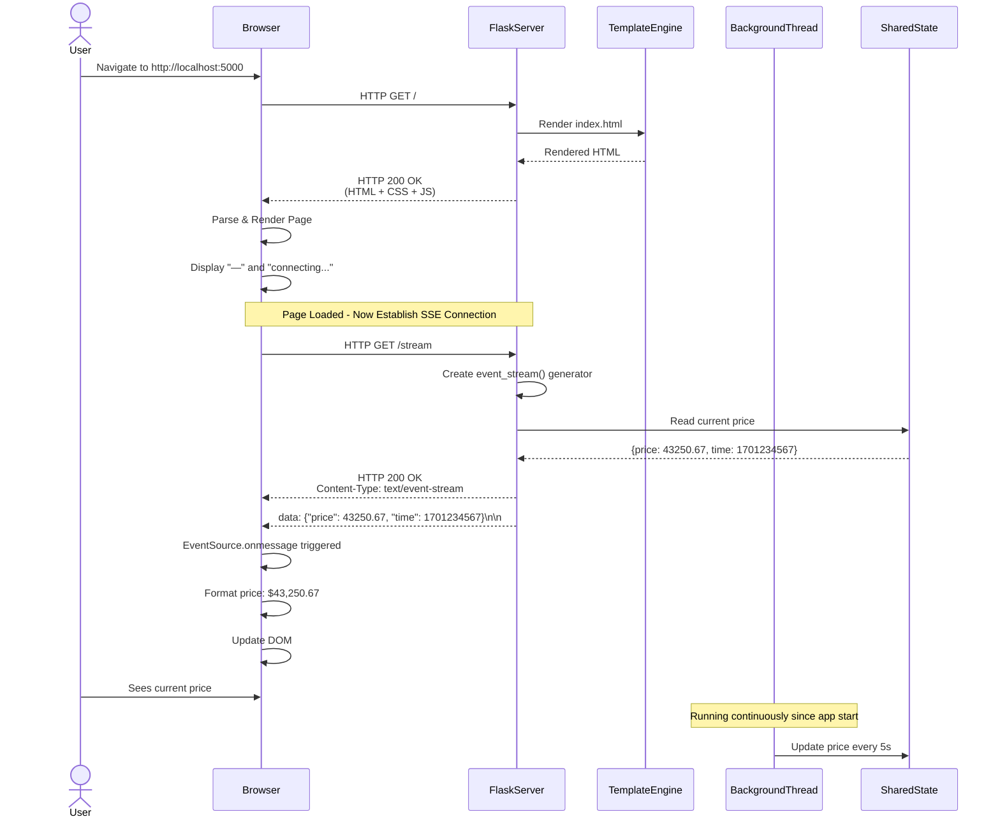

### Sequence Diagram 2: Real-Time Price Update Flow

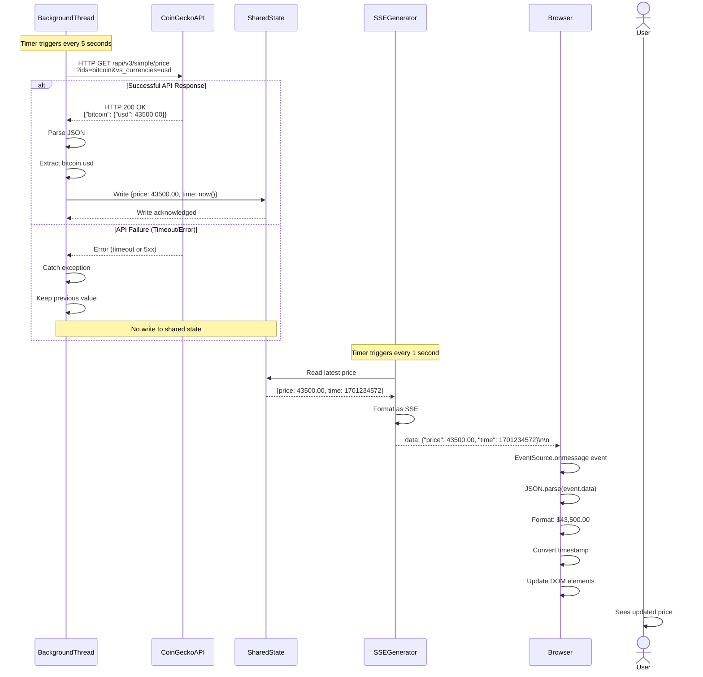

### Sequence Diagram 3: Error Handling & Recovery

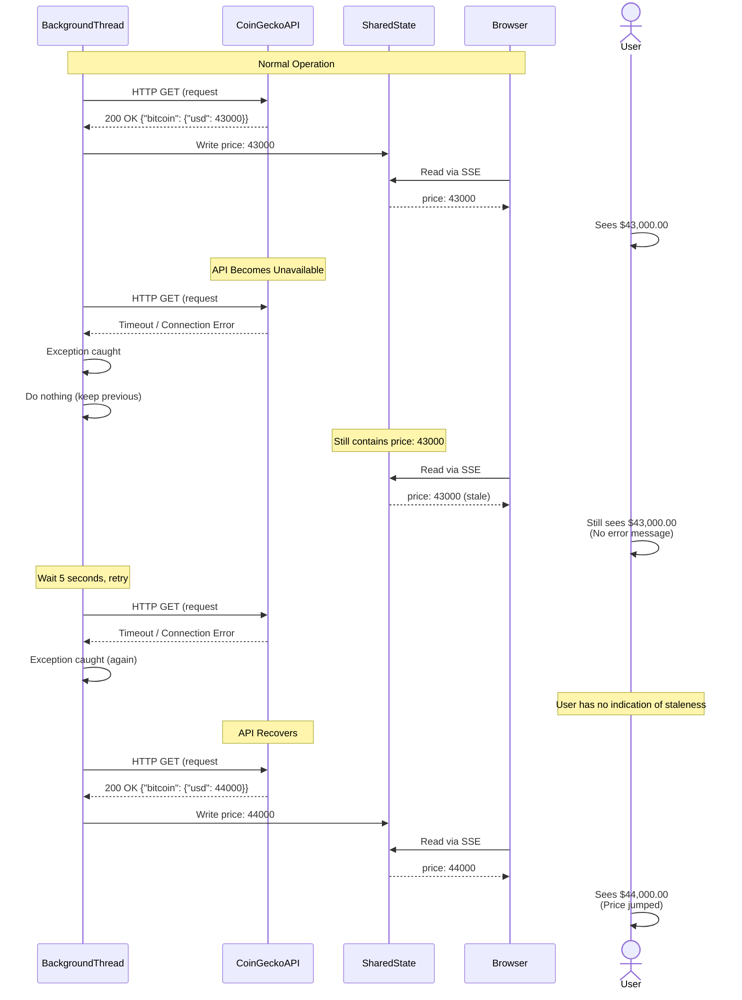

### Sequence Diagram 4: Multiple Client Connections

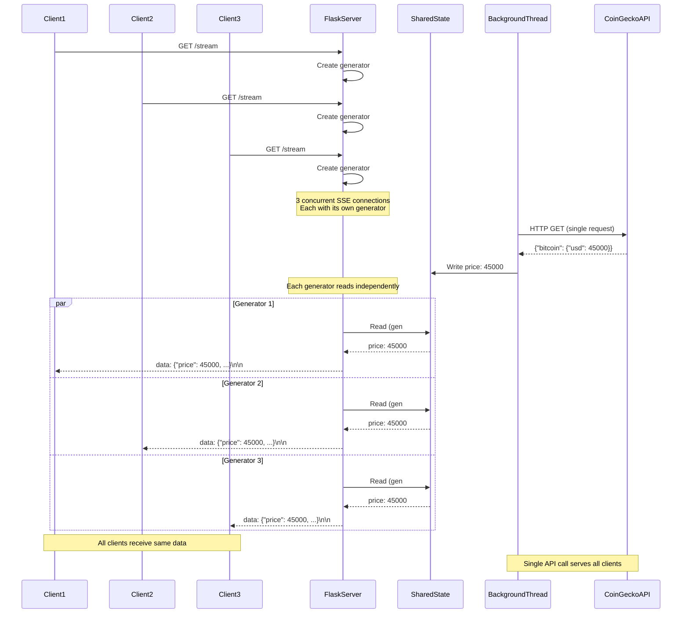

### Detailed Explanation

**Workflow 1: Initial Page Load & Connection Establishment**

**Overview:**
This sequence shows the complete user journey from navigating to the application through establishing the real-time price stream connection.

**Key Steps:**
1. **HTTP Request for Page**: User navigates to root URL
2. **Template Rendering**: Flask renders HTML template with embedded CSS/JavaScript
3. **Page Load**: Browser parses and displays initial UI (placeholder values)
4. **SSE Connection**: Browser JavaScript initiates EventSource connection to `/stream`
5. **Generator Creation**: Flask creates a new generator instance for this client
6. **Initial Data**: Server immediately sends current price from shared state
7. **UI Update**: Browser receives first event and updates display

**Timing:**
- Page load: ~100-500ms
- SSE connection establishment: ~50-200ms
- First price display: <1 second total

**Error Scenarios:**
- If shared state is empty (null price), UI shows "—" until first fetch completes
- If SSE connection fails, browser shows "connection lost, retrying..."

**Workflow 2: Real-Time Price Update Flow**

**Overview:**
The continuous cycle of fetching, storing, and streaming price updates to connected clients.

**Key Steps:**
1. **Background Fetch**: Timer triggers API call every 5 seconds
2. **API Response Handling**: Success path or error path
3. **State Update**: New price written to shared dictionary (on success)
4. **SSE Stream**: Generator reads state every 1 second
5. **Client Update**: Browser receives event and updates DOM

**Timing Characteristics:**
- Data freshness: Up to 5 seconds stale (API polling interval)
- Update frequency: Client UI updates every 1 second
- Latency: <10ms from state read to client receive (local network)

**Critical Observation:**
The system sends 5 updates per API fetch (1 second stream interval ÷ 5 second fetch interval), meaning the same price value is sent multiple times. This provides smooth UX but is technically redundant.

**Workflow 3: Error Handling & Recovery**

**Overview:**
Demonstrates system behavior during API failures and recovery, highlighting the graceful degradation strategy.

**Key Characteristics:**
- **Silent Failure**: Errors are caught but not logged or reported
- **Stale Data**: Clients continue receiving old price without notification
- **No User Feedback**: UI doesn't indicate data staleness
- **Automatic Recovery**: System resumes normal operation when API recovers

**Issues Identified:**
1. Users can't tell if price is stale
2. No visibility into errors for operators
3. No retry logic with backoff
4. Price could be hours old during extended outages

**Improvement Opportunities:**
1. Add timestamp age check in UI
2. Show "Last updated X seconds ago"
3. Display warning if data is >30 seconds old
4. Implement exponential backoff retries
5. Add monitoring and alerting

**Workflow 4: Multiple Client Connections**

**Overview:**
Shows how the system handles multiple concurrent browser connections sharing the same background data fetcher.

**Key Insights:**
1. **Single Fetcher**: Only one background thread polls API (efficient)
2. **Multiple Generators**: Each client gets dedicated generator (one per connection)
3. **Shared State**: All generators read from same memory location
4. **Consistent Data**: All clients receive same price at approximately same time
5. **Resource Scaling**: More clients = more generators but same API usage

**Scalability Implications:**
- ✅ API rate limits not affected by client count
- ⚠️ Each client connection consumes server resources (thread/coroutine)
- ⚠️ Shared state becomes bottleneck with many clients
- ⚠️ No load balancing across multiple server instances

**Design Decisions:**

1. **SSE vs Polling**:
   - **Rationale**: SSE eliminates need for clients to poll
   - **Benefit**: Reduces request overhead, lower latency
   - **Trade-off**: Long-lived connections consume resources

2. **1-Second Stream Interval**:
   - **Rationale**: Balance smoothness with resource usage
   - **Alternative**: Send only on price change (more efficient but complex)

3. **Silent Error Handling**:
   - **Rationale**: Keep system running, avoid alarming users
   - **Issue**: Violates observability best practices

4. **In-Memory Shared State**:
   - **Rationale**: Simplicity and minimal latency
   - **Issue**: Doesn't work with multiple server instances

**NFR Analysis:**

- **Performance**:
  - ✅ Low latency (<10ms for price reads)
  - ✅ Efficient API usage (1 call for N clients)
  - ⚠️ Generator overhead grows linearly with clients

- **Reliability**:
  - ✅ Graceful degradation on API failures
  - ⚠️ No recovery mechanism
  - ⚠️ Silent failures hide problems

- **Scalability**:
  - ✅ API load doesn't increase with clients
  - ⚠️ Server resources scale linearly with connections
  - ⚠️ Single-instance limitation

- **Security**:
  - ⚠️ No authentication on streams
  - ⚠️ No rate limiting per client
  - ⚠️ Open to abuse (connection exhaustion)

---


## Phased Development Approach

Given the current MVP state and the complexity required for production readiness, this section outlines a phased evolution strategy.

### Phase 1: Initial Implementation (Current State - MVP)

**Objective**: Prove concept with minimal viable functionality

**Architecture Characteristics:**
- Single Flask application instance
- Development server (not production-grade)
- In-memory shared state
- No authentication or authorization
- No monitoring or logging
- HTTP only (no HTTPS)
- Single server deployment

**Suitable For:**
- Proof of concept / demo
- Development environment
- Learning and experimentation
- Low-traffic personal use (<10 concurrent users)

**Diagram: Phase 1 - Simplified Architecture**

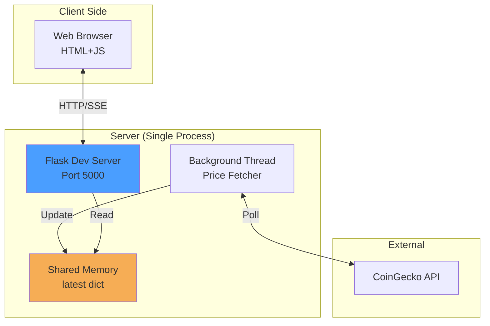

**Limitations:**
- ❌ Not production-ready
- ❌ No scalability
- ❌ No security hardening
- ❌ No error visibility
- ❌ No high availability

### Phase 2: Production-Ready Foundation

**Objective**: Make system production-ready with essential enterprise features

**Key Improvements:**
1. **Production WSGI Server**: Replace Flask dev server with Gunicorn
2. **HTTPS/SSL**: Add SSL termination at load balancer or reverse proxy
3. **Logging**: Structured logging to files or stdout
4. **Error Handling**: Proper exception handling with notifications
5. **Health Checks**: Endpoints for liveness and readiness
6. **Configuration Management**: Environment variables for all settings
7. **Docker Containers**: Containerize for consistent deployment

**Architecture Changes:**
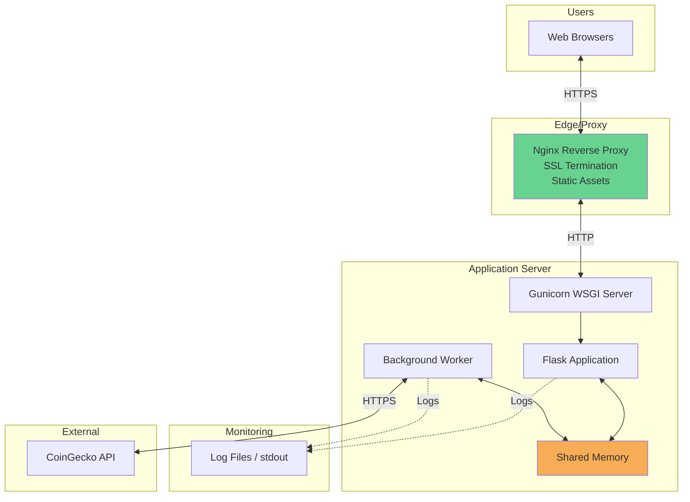

**Deliverables:**
- Dockerfile and docker-compose.yml
- Nginx configuration
- Environment variable configuration
- Logging configuration
- Health check endpoints (`/health`, `/ready`)
- Deployment documentation

**Timeline**: 1-2 weeks

**Suitable For:**
- Small production deployments
- Single-region deployment
- Moderate traffic (<100 concurrent users)
- Single server with manual scaling

### Phase 3: Distributed & Scalable Architecture

**Objective**: Enable horizontal scaling and multi-instance deployment

**Key Improvements:**
1. **Redis Integration**: Replace in-memory state with Redis
2. **Separate Workers**: Decouple fetcher from web app
3. **Container Orchestration**: Deploy on Kubernetes or ECS
4. **Load Balancer**: Add ALB/NLB for traffic distribution
5. **Auto-scaling**: Implement horizontal pod/container autoscaling
6. **Monitoring Stack**: Add Prometheus + Grafana

**Architecture Changes:**
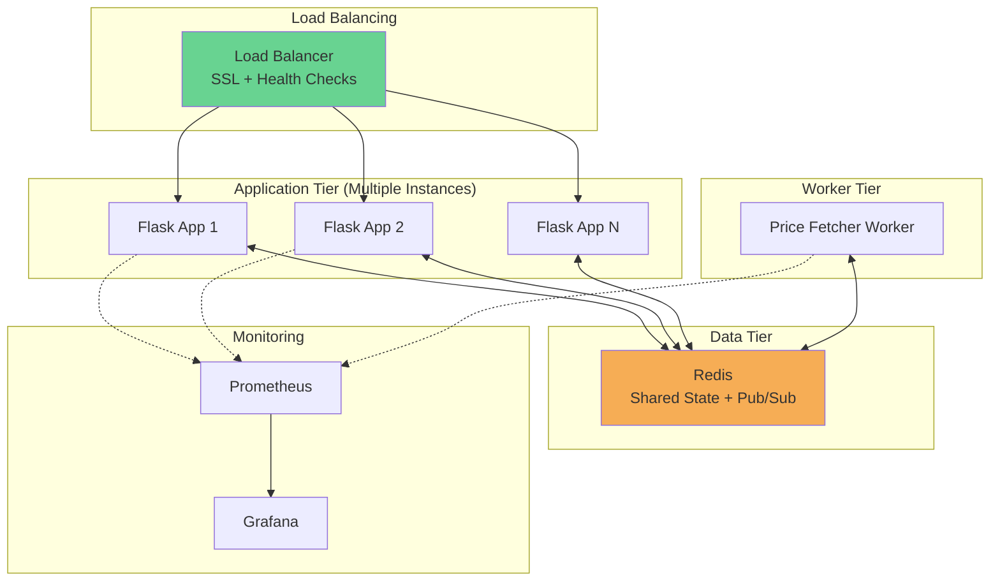

**Deliverables:**
- Kubernetes manifests or ECS task definitions
- Redis configuration and setup
- Separate worker application
- Prometheus metrics exporters
- Grafana dashboards
- Infrastructure as Code (Terraform/CloudFormation)

**Timeline**: 3-4 weeks

**Suitable For:**
- Production deployments at scale
- Multi-region potential
- High traffic (1000s of concurrent users)
- Enterprise environments

### Phase 4: Advanced Features & Optimization

**Objective**: Add advanced features for enterprise-grade deployment

**Key Improvements:**
1. **Authentication & Authorization**: User login, API keys
2. **Rate Limiting**: Per-user connection limits
3. **CDN Integration**: CloudFront/Cloudflare for static assets
4. **Multi-Currency Support**: Beyond just USD
5. **Historical Data**: Price history and charting
6. **WebSocket Option**: Alternative to SSE
7. **API Gateway**: Centralized API management
8. **Advanced Monitoring**: APM, distributed tracing
9. **Disaster Recovery**: Backup/restore procedures
10. **Performance Optimization**: Caching, compression

**Architecture Changes:**
- Add authentication service (OAuth2, JWT)
- Integrate API Gateway (Kong, AWS API Gateway)
- Add PostgreSQL for historical data
- Implement CDN for global edge caching
- Add distributed tracing (Jaeger, Zipkin)

**Timeline**: 6-8 weeks

**Suitable For:**
- Enterprise production
- Global deployment
- Premium features
- SLA requirements

### Migration Path

**Phase 1 → Phase 2**:
1. Add Dockerfile to existing code
2. Configure Gunicorn as WSGI server
3. Set up Nginx reverse proxy
4. Implement logging library (e.g., structlog)
5. Add health check endpoints
6. Test in staging environment
7. Deploy to production

**Key Challenges**: Minimal code changes required

**Phase 2 → Phase 3**:
1. Set up Redis instance
2. Modify code to use Redis instead of in-memory dict
3. Extract worker to separate application
4. Implement pub/sub pattern for price updates
5. Set up container orchestration platform
6. Configure load balancer
7. Deploy multiple instances
8. Test scaling behavior

**Key Challenges**: 
- Redis connection management
- State synchronization
- Worker coordination (leader election)
- Testing multi-instance behavior

**Phase 3 → Phase 4**:
1. Design authentication flow
2. Implement authentication service
3. Add authorization middleware
4. Set up API gateway
5. Implement rate limiting
6. Add historical data storage
7. Create additional features incrementally
8. Extensive testing and optimization

**Key Challenges**:
- Backward compatibility
- User migration
- Performance testing at scale
- Security hardening

---

## Non-Functional Requirements Analysis

### Scalability

**Current State (Phase 1):**
- ❌ **Vertical Scaling Only**: Limited by single server resources
- ❌ **No Horizontal Scaling**: In-memory state prevents multi-instance deployment
- ❌ **Connection Limits**: Flask dev server not designed for high concurrency
- ❌ **Single Bottleneck**: One background thread fetches for all clients

**Scalability Issues:**
1. **Shared State**: In-memory dict doesn't work across processes/servers
2. **Thread Per Connection**: SSE generators consume threads (GIL limitations)
3. **No Load Distribution**: Can't run multiple instances
4. **No State Persistence**: Restart loses all state

**Phase 2 Improvements:**
- ✅ Better WSGI server (Gunicorn) handles more concurrent connections
- ⚠️ Still limited to vertical scaling
- ⚠️ Still single instance

**Phase 3 Solution:**
- ✅ **Horizontal Scaling**: Redis enables multi-instance deployment
- ✅ **Load Balancing**: Distribute traffic across instances
- ✅ **Auto-scaling**: Scale up/down based on demand
- ✅ **Decoupled Workers**: Fetch layer scales independently

**Target Capacity:**
- Phase 1: 10-50 concurrent users
- Phase 2: 100-500 concurrent users
- Phase 3: 1,000-10,000+ concurrent users

**Scaling Metrics to Monitor:**
- Concurrent SSE connections
- Memory usage per connection
- CPU utilization
- Network bandwidth
- Redis connection pool size

### Performance

**Current State:**
- ✅ **Low Latency**: In-memory reads are fast (<1ms)
- ✅ **Lightweight Protocol**: SSE has minimal overhead
- ✅ **Small Payloads**: JSON payloads are compact (~50 bytes)
- ⚠️ **No Compression**: Data not compressed
- ⚠️ **No Caching**: Every SSE stream reads from state
- ❌ **Inefficient Updates**: Sends same data 5 times per price change

**Performance Metrics:**

**Latency:**
- API Call: ~100-500ms (network + CoinGecko processing)
- State Update: <1ms (memory write)
- SSE Generation: <5ms (JSON serialization)
- Client Receive: <10ms (local network)
- **Total End-to-End**: ~115-516ms from API response to client display

**Throughput:**
- API Calls: 12 per minute (every 5 seconds)
- SSE Events: 60 per minute per client (every 1 second)
- For 100 clients: 6,000 events/minute
- Bandwidth per client: ~3KB/minute (very low)

**Resource Usage (Phase 1):**
- Memory: ~50MB base + ~1MB per 100 connections
- CPU: <5% idle, ~10-20% with 50 clients
- Network: Minimal (<1 Mbps for 100 clients)

**Optimization Opportunities:**

1. **Send Only on Change**: Reduce events from 60/min to 12/min per client
   - **Benefit**: 80% reduction in events
   - **Trade-off**: More complex client-side logic

2. **Implement Compression**: Gzip SSE stream
   - **Benefit**: ~60-70% bandwidth reduction
   - **Trade-off**: Slight CPU overhead

3. **API Response Caching**: Cache CoinGecko response for 4 seconds
   - **Benefit**: Reduce API calls during high traffic
   - **Trade-off**: Slightly staler data

4. **Connection Pooling**: Reuse HTTP connections to CoinGecko
   - **Benefit**: Reduce connection overhead
   - **Trade-off**: None (best practice)

**Phase 3 Performance Enhancements:**
- Redis adds ~1-2ms latency but enables scaling
- CDN serves static assets from edge (50-100ms improvement globally)
- Load balancer adds ~5-10ms overhead
- Overall latency impact: +10-20ms but supports 100x more users

### Security

**Current State:**
- ❌ **No HTTPS**: Data transmitted in plain text
- ❌ **No Authentication**: Anyone can access streams
- ❌ **No Authorization**: No access control
- ❌ **No Rate Limiting**: Vulnerable to abuse
- ❌ **No Input Validation**: Assumes data is safe
- ❌ **No CSRF Protection**: Not applicable (no state-changing operations)
- ❌ **No Security Headers**: Missing CSP, HSTS, X-Frame-Options
- ❌ **Silent Error Handling**: Could hide security issues
- ❌ **No Audit Logging**: No visibility into access patterns

**Threat Model:**

**High Risk Threats:**
1. **Man-in-the-Middle Attack**: No HTTPS allows traffic interception
2. **Connection Exhaustion**: Unlimited connections can DoS server
3. **Data Exposure**: Anyone can access price stream

**Medium Risk Threats:**
1. **API Key Exposure**: If added, could be logged or exposed
2. **Dependency Vulnerabilities**: Flask, requests may have CVEs

**Low Risk Threats:**
1. **XSS**: Limited attack surface (no user input in current version)
2. **SQL Injection**: No database (not applicable)

**Security Recommendations:**

**Phase 2 - Essential Security:**
1. **HTTPS/TLS**: 
   - Use Let's Encrypt for free SSL certificates
   - Configure Nginx with strong cipher suites
   - Enforce HTTPS redirect

2. **Security Headers**:
   ```python
   @app.after_request
   def add_security_headers(response):
       response.headers['X-Content-Type-Options'] = 'nosniff'
       response.headers['X-Frame-Options'] = 'DENY'
       response.headers['X-XSS-Protection'] = '1; mode=block'
       response.headers['Strict-Transport-Security'] = 'max-age=31536000'
       return response
   ```

3. **Basic Rate Limiting**:
   - Limit connections per IP (e.g., 5 concurrent SSE streams)
   - Use Flask-Limiter library

4. **Error Handling**:
   - Log exceptions instead of silent swallowing
   - Return generic error messages to clients

**Phase 3 - Advanced Security:**
1. **Authentication**: JWT tokens or OAuth2
2. **API Gateway**: Centralized security policies
3. **WAF**: Protect against common attacks
4. **Secrets Management**: Use vault for sensitive config
5. **Network Segmentation**: Security groups, private subnets
6. **Audit Logging**: Track all access and actions

**Phase 4 - Enterprise Security:**
1. **DDoS Protection**: CloudFlare or AWS Shield
2. **Penetration Testing**: Regular security audits
3. **Compliance**: SOC2, GDPR if handling user data
4. **Intrusion Detection**: Monitor for anomalies
5. **Zero Trust**: Principle of least privilege

**Security Checklist:**
- [ ] HTTPS everywhere (Phase 2)
- [ ] Security headers (Phase 2)
- [ ] Rate limiting (Phase 2)
- [ ] Logging and monitoring (Phase 2)
- [ ] Authentication (Phase 3)
- [ ] Authorization (Phase 3)
- [ ] Regular dependency updates (All phases)
- [ ] Security scanning in CI/CD (Phase 3)
- [ ] Incident response plan (Phase 3)
- [ ] Regular security audits (Phase 4)

### Reliability

**Current State:**
- ⚠️ **Graceful Degradation**: Keeps previous value on API failure
- ❌ **Single Point of Failure**: No redundancy
- ❌ **No Retry Logic**: Waits for next cycle after failure
- ❌ **No Health Checks**: Can't detect if service is unhealthy
- ❌ **No Alerting**: Silent failures go unnoticed
- ❌ **No Data Persistence**: Restart loses state
- ❌ **No Circuit Breaker**: Continues calling failing API

**Reliability Metrics:**

**Current Availability**: ~99% (assumes CoinGecko API ~99.5% uptime)
- Single server failure: Complete outage
- API failure: Stale data (degraded but not down)

**Target Availability**:
- Phase 2: 99.5% (SLA: 3.6 hours downtime/month)
- Phase 3: 99.9% (SLA: 43 minutes downtime/month)
- Phase 4: 99.95% (SLA: 21 minutes downtime/month)

**Failure Modes & Mitigations:**

1. **CoinGecko API Unavailable**
   - Current: Keep previous value (silent failure)
   - Phase 2: Add exponential backoff retries, logging
   - Phase 3: Circuit breaker pattern, fallback to cache
   - Phase 4: Multiple API sources, automatic failover

2. **Application Crash**
   - Current: Complete outage, manual restart required
   - Phase 2: Process manager (systemd), auto-restart
   - Phase 3: Container orchestration handles restarts, multiple instances
   - Phase 4: Auto-healing, zero-downtime deployments

3. **Server Hardware Failure**
   - Current: Complete outage, manual recovery
   - Phase 2: Backup server, manual failover
   - Phase 3: Multi-instance deployment, automatic failover
   - Phase 4: Multi-AZ deployment, automated DR

4. **Network Issues**
   - Current: Clients lose connection, must refresh
   - Phase 2: Client-side auto-reconnect (SSE built-in)
   - Phase 3: Load balancer health checks route around issues
   - Phase 4: Multi-region deployment, geo-routing

**Reliability Improvements:**

**Phase 2:**
- Implement retry logic with exponential backoff
- Add comprehensive error logging
- Create health check endpoints
- Set up basic monitoring (uptime monitoring)
- Process supervision (systemd, supervisord)

**Phase 3:**
- Multiple application instances (N+1 redundancy)
- Redis replication for state persistence
- Load balancer health checks
- Automated alerting (PagerDuty, Opsgenie)
- Backup worker instances

**Phase 4:**
- Multi-region deployment
- Disaster recovery procedures
- Automated failover
- Regular DR testing
- SLA monitoring and reporting

**MTTR (Mean Time To Recovery):**
- Phase 1: 30-60 minutes (manual detection + fix)
- Phase 2: 5-10 minutes (automated detection + manual fix)
- Phase 3: <1 minute (automated detection + automated recovery)
- Phase 4: <10 seconds (proactive monitoring + instant failover)

### Maintainability

**Current State:**
- ✅ **Simple Code**: Easy to understand (~50 lines of logic)
- ✅ **Clear Structure**: Separation of concerns
- ✅ **Minimal Dependencies**: Only Flask and requests
- ⚠️ **No Documentation**: Minimal inline comments
- ❌ **No Logging**: No observability
- ❌ **No Tests**: No unit, integration, or E2E tests
- ❌ **No CI/CD**: Manual deployment process
- ❌ **No Versioning Strategy**: No semantic versioning
- ❌ **No Configuration Management**: Hard-coded values

**Maintainability Improvements:**

**Phase 2 - Development Best Practices:**

1. **Logging Framework**:
   ```python
   import logging
   import structlog
   
   logger = structlog.get_logger()
   logger.info("price_updated", price=price, source="coingecko")
   ```

2. **Configuration Management**:
   ```python
   import os
   
   POLL_INTERVAL = int(os.getenv('POLL_INTERVAL', 5))
   STREAM_INTERVAL = int(os.getenv('STREAM_INTERVAL', 1))
   API_URL = os.getenv('API_URL', 'https://api.coingecko.com/...')
   ```

3. **Unit Tests**:
   - Test price fetching logic
   - Test SSE generator
   - Mock CoinGecko API responses
   - Aim for >80% code coverage

4. **Documentation**:
   - API documentation (endpoints, parameters)
   - Deployment guide
   - Troubleshooting guide
   - Architecture diagrams (this document!)

5. **Code Quality**:
   - Use Black for code formatting
   - Flake8 for linting
   - Type hints with mypy
   - Pre-commit hooks

**Phase 3 - Operational Excellence:**

1. **CI/CD Pipeline**:
   - Automated testing on PRs
   - Automated builds
   - Automated deployments to staging
   - Manual approval for production

2. **Infrastructure as Code**:
   - Terraform or CloudFormation
   - Version controlled infrastructure
   - Repeatable deployments

3. **Monitoring & Observability**:
   - Metrics (RED: Rate, Errors, Duration)
   - Distributed tracing
   - Log aggregation and search
   - Custom dashboards

4. **Operational Runbooks**:
   - Deployment procedures
   - Rollback procedures
   - Incident response playbooks
   - Common troubleshooting scenarios

**Phase 4 - Enterprise Standards:**

1. **Advanced Testing**:
   - Integration tests
   - End-to-end tests
   - Performance testing
   - Chaos engineering

2. **Change Management**:
   - Feature flags
   - Canary deployments
   - A/B testing capability
   - Automated rollback on errors

3. **Documentation Portal**:
   - API reference
   - User guides
   - Developer guides
   - Architecture decision records (ADRs)

**Maintainability Metrics:**
- Code complexity: Cyclomatic complexity <10 per function
- Test coverage: >80% line coverage
- Deployment frequency: Multiple times per day (Phase 3+)
- Lead time for changes: <1 day (Phase 3+)
- MTTR: <1 hour (Phase 3+)

---

## Risks and Mitigations

### Technical Risks

**1. Third-Party API Dependency**

**Risk Level**: HIGH
**Description**: Complete dependency on CoinGecko API availability and reliability

**Impacts**:
- API downtime = stale data for users
- Rate limiting = service degradation
- API changes = potential breakage
- Cost changes = budget impact (if moving to paid tier)

**Mitigations**:
- **Phase 1**: Accept risk (appropriate for MVP)
- **Phase 2**: 
  - Implement robust error handling and retry logic
  - Add logging and monitoring for API failures
  - Set up alerts for extended outages
- **Phase 3**:
  - Implement API response caching
  - Add circuit breaker pattern
  - Monitor API health proactively
- **Phase 4**:
  - Integrate multiple price APIs (Coinbase, Binance, etc.)
  - Implement fallback mechanism
  - Price aggregation across sources for accuracy

**2. Scalability Limitations**

**Risk Level**: MEDIUM
**Description**: Current architecture doesn't scale horizontally

**Impacts**:
- Can't handle traffic spikes
- Single server resource limits
- Poor user experience under load

**Mitigations**:
- **Phase 2**: Monitor resource usage, set up alerts
- **Phase 3**: Implement Redis-based architecture for horizontal scaling
- Conduct load testing before high-traffic events
- Have scale-up plan ready

**3. Security Vulnerabilities**

**Risk Level**: HIGH (for production), LOW (for MVP/demo)
**Description**: Multiple security gaps in current implementation

**Impacts**:
- Data interception (no HTTPS)
- Service abuse (no rate limiting)
- Resource exhaustion attacks
- Reputational damage

**Mitigations**:
- **Phase 2 (CRITICAL for production)**:
  - Implement HTTPS immediately
  - Add basic rate limiting
  - Security headers
  - Regular dependency updates
- **Phase 3**:
  - Implement authentication
  - Add WAF
  - Security audit
- **Ongoing**: Monitor CVEs, automated dependency scanning

**4. Silent Failures**

**Risk Level**: MEDIUM
**Description**: Errors are caught but not reported, leading to invisible issues

**Impacts**:
- Stale data shown to users without indication
- Operational blind spots
- Difficult troubleshooting
- Poor user experience

**Mitigations**:
- **Phase 2**:
  - Implement comprehensive logging
  - Add error monitoring (Sentry, Rollbar)
  - Display data freshness to users
  - Alert on repeated failures
- **Phase 3**:
  - Real-time monitoring dashboards
  - Automated alerts to ops team
  - SLA tracking

### Operational Risks

**5. Single Point of Failure**

**Risk Level**: HIGH (for production)
**Description**: Single server means single point of failure

**Impacts**:
- Complete outage on server failure
- No redundancy
- Extended downtime for hardware issues

**Mitigations**:
- **Phase 2**: 
  - Implement process supervision for auto-restart
  - Set up backup server (cold standby)
  - Document manual failover procedure
- **Phase 3**:
  - Multi-instance deployment
  - Automated failover
  - Load balancer health checks

**6. No Disaster Recovery Plan**

**Risk Level**: MEDIUM
**Description**: No backup, recovery, or DR procedures

**Impacts**:
- Data loss on failure (though data is ephemeral)
- Extended recovery time
- Unclear recovery procedures

**Mitigations**:
- **Phase 2**:
  - Document recovery procedures
  - Regular backup of configuration
  - Test restoration process
- **Phase 3**:
  - Automated backups (Redis snapshots)
  - Multi-AZ deployment
  - DR testing schedule
- **Phase 4**:
  - Multi-region deployment
  - Automated DR failover

**7. Insufficient Monitoring**

**Risk Level**: MEDIUM
**Description**: No visibility into system health and performance

**Impacts**:
- Slow incident detection
- Difficult troubleshooting
- Can't measure reliability
- No capacity planning data

**Mitigations**:
- **Phase 2**:
  - Basic uptime monitoring
  - Log aggregation
  - Error rate tracking
- **Phase 3**:
  - Comprehensive metrics (Prometheus)
  - Visualization (Grafana)
  - Automated alerting
- **Phase 4**:
  - APM (Application Performance Monitoring)
  - Distributed tracing
  - User experience monitoring

### Business Risks

**8. API Cost Escalation**

**Risk Level**: LOW to MEDIUM
**Description**: Moving from free to paid tier if traffic increases

**Impacts**:
- Unexpected costs
- Need to add authentication/billing
- Service limitations

**Mitigations**:
- Monitor API usage closely
- Implement caching to reduce calls
- Plan for paid tier costs in budget
- Consider alternative APIs
- Implement authentication to control usage

**9. Lack of Feature Differentiation**

**Risk Level**: LOW
**Description**: Simple price display has limited value proposition

**Impacts**:
- Limited user engagement
- No competitive advantage
- Difficulty monetizing

**Mitigations**:
- **Phase 4 enhancements**:
  - Historical data and charts
  - Multiple cryptocurrencies
  - Price alerts and notifications
  - Portfolio tracking
  - Market analysis features

### Risk Summary Matrix

| Risk | Phase 1 | Phase 2 | Phase 3 | Phase 4 |
|------|---------|---------|---------|---------|
| API Dependency | HIGH | HIGH | MEDIUM | LOW |
| Scalability | HIGH | MEDIUM | LOW | LOW |
| Security | HIGH* | LOW | LOW | LOW |
| Silent Failures | HIGH | MEDIUM | LOW | LOW |
| Single Point of Failure | HIGH | HIGH | LOW | LOW |
| No DR Plan | MEDIUM | MEDIUM | LOW | LOW |
| Insufficient Monitoring | HIGH | MEDIUM | LOW | LOW |
| API Costs | LOW | LOW | LOW | MEDIUM |

*Acceptable for MVP/demo, unacceptable for production

---

## Technology Stack Recommendations

### Current Stack (Phase 1)

**Backend**:
- **Flask 2.0+**: Micro web framework
  - Pros: Simple, lightweight, great for prototyping
  - Cons: Not designed for production at scale
  
- **Python 3.7+**: Programming language
  - Pros: Easy to read/write, rich ecosystem
  - Cons: GIL limits thread parallelism

- **Requests**: HTTP library
  - Pros: Simple, well-documented
  - Cons: Synchronous (blocks thread)

**Frontend**:
- **Vanilla JavaScript**: No frameworks
  - Pros: No dependencies, fast loading
  - Cons: Limited for complex UIs

- **EventSource API**: Native SSE support
  - Pros: Built into browsers, auto-reconnect
  - Cons: Unidirectional only

**Deployment**:
- Flask Development Server
  - Pros: Zero configuration
  - Cons: Not production-grade, single-threaded

### Recommended Stack (Phase 2)

**Backend Enhancements**:
- **Gunicorn**: Production WSGI server
  - Why: Mature, reliable, widely used
  - Config: 4-8 workers, worker class sync or gevent
  
- **Structlog**: Structured logging
  - Why: Better than print statements, JSON output
  - Alternative: Python logging with JSON formatter

- **python-dotenv**: Environment variable management
  - Why: 12-factor app compliance
  - Use: Configuration management

**Infrastructure**:
- **Nginx**: Reverse proxy
  - Why: SSL termination, static file serving, load balancing
  - Alternative: Apache, Caddy

- **Docker**: Containerization
  - Why: Consistent environments, easy deployment
  - Base image: python:3.11-slim

- **Docker Compose**: Local orchestration
  - Why: Multi-container management for dev/test

**Monitoring**:
- **Prometheus Client**: Metrics
  - Why: Industry standard, great ecosystem
  - Metrics: Request rate, errors, duration, SSE connections

### Recommended Stack (Phase 3)

**State Management**:
- **Redis 7.0+**: In-memory data store
  - Why: Fast, supports pub/sub, widely supported
  - Use cases: Shared state, caching, pub/sub
  - Alternative: Memcached (simpler but no pub/sub)

**Container Orchestration**:
- **Kubernetes**: Container orchestration
  - Why: Industry standard, feature-rich, cloud-agnostic
  - Services: Deployment, Service, ConfigMap, Secret
  - Alternative: AWS ECS (simpler but AWS-specific)

**Load Balancing**:
- **AWS ALB** / **Azure Load Balancer** / **GCP Load Balancer**
  - Why: Managed service, SSL termination, health checks
  - Alternative: Nginx Plus, HAProxy

**Monitoring Stack**:
- **Prometheus**: Metrics collection and storage
  - Why: Open source, powerful query language
  
- **Grafana**: Visualization
  - Why: Beautiful dashboards, wide data source support
  
- **ELK Stack** (Elasticsearch, Logstash, Kibana): Logs
  - Why: Powerful search and analysis
  - Alternative: Splunk, Datadog

**Caching**:
- **Redis**: API response cache
  - TTL: 4-5 seconds
  - Alternative: Separate Redis instance or cluster

### Recommended Stack (Phase 4)

**Authentication**:
- **Auth0** or **Keycloak**: Identity provider
  - Why: OAuth2/OIDC standard, handles complexity
  - Alternative: Roll your own with PyJWT (more work)

**API Gateway**:
- **Kong**: Open source API gateway
  - Why: Rate limiting, auth, monitoring
  - Alternative: AWS API Gateway, Tyk

**Database** (for historical data):
- **PostgreSQL 15+**: Relational database
  - Why: Reliable, feature-rich, time-series support
  - Use: User data, price history
  - Alternative: TimescaleDB (PostgreSQL extension for time-series)

**CDN**:
- **CloudFlare**: CDN and security
  - Why: Free tier generous, DDoS protection, global presence
  - Alternative: AWS CloudFront, Fastly

**Advanced Monitoring**:
- **Jaeger** or **Zipkin**: Distributed tracing
  - Why: Debug complex distributed systems
  
- **Sentry**: Error tracking
  - Why: Detailed error context, release tracking

### Technology Decision Matrix

| Capability | Phase 1 | Phase 2 | Phase 3 | Phase 4 |
|------------|---------|---------|---------|---------|
| Web Framework | Flask | Flask | Flask | Flask |
| WSGI Server | Dev Server | Gunicorn | Gunicorn | Gunicorn |
| Reverse Proxy | None | Nginx | Nginx/LB | API Gateway + LB |
| State Storage | Memory | Memory | Redis | Redis Cluster |
| Container | None | Docker | K8s/ECS | K8s/ECS |
| Monitoring | None | Logs + Basic | Prometheus + Grafana | APM + Tracing |
| Security | None | HTTPS + Headers | + Auth | + WAF + Audit |

### Alternative Architectures

**Option A: Async Python (Alternative to Threading)**
- Replace Flask with **FastAPI** or **Sanic**
- Use async/await instead of threads
- **Benefits**: Better scalability, more efficient resource use
- **Trade-offs**: More complex code, different programming model
- **When**: If expecting very high concurrent connections (10k+)

**Option B: WebSocket Instead of SSE**
- Use **Flask-SocketIO** with WebSocket transport
- **Benefits**: Bidirectional communication, widely understood
- **Trade-offs**: More complex than SSE, requires socket.io client library
- **When**: If need bidirectional communication (e.g., user commands)

**Option C: Serverless Architecture**
- **Backend**: AWS Lambda + API Gateway
- **State**: DynamoDB or ElastiCache
- **Worker**: Scheduled Lambda or ECS Fargate
- **Benefits**: Pay per use, auto-scaling, low operational overhead
- **Trade-offs**: Cold starts, SSE challenges with Lambda
- **When**: Sporadic or unpredictable traffic patterns

**Option D: Event-Driven Architecture**
- **Message Broker**: RabbitMQ or Apache Kafka
- **Pattern**: Pub/sub for price updates
- **Benefits**: More decoupled, easier to add consumers
- **Trade-offs**: Additional complexity and infrastructure
- **When**: Multiple downstream consumers of price data

### Dependency Management

**Requirements File Structure**:
```
requirements/
  base.txt          # Core dependencies
  dev.txt           # Development tools (includes base)
  prod.txt          # Production extras (includes base)
  test.txt          # Testing dependencies (includes base)
```

**Security**:
- Use **pip-audit** or **Safety** to scan for vulnerabilities
- Pin exact versions in production
- Use **Dependabot** or **Renovate** for automated updates

---

## Next Steps

### Immediate Actions (Phase 1 - Current State)

1. **Documentation** (This Document)
   - ✅ Architecture documentation complete
   - Maintain and update as system evolves

2. **Add Basic Error Visibility**
   - Add print statements or basic logging
   - Log API failures with timestamps
   - Display "Last updated" time in UI
   - Estimated effort: 2-4 hours

3. **Configuration Management**
   - Move hard-coded values to environment variables
   - Create .env.example file
   - Estimated effort: 1-2 hours

4. **Basic Testing**
   - Manual testing checklist
   - Test API failure scenarios
   - Test multiple client connections
   - Estimated effort: 2-3 hours

### Moving to Phase 2 (Production-Ready)

**Prerequisites**:
- Decision to deploy to production
- Basic infrastructure available (server/VM)
- Domain name and SSL certificate

**Implementation Steps** (2-3 weeks):

**Week 1: Core Improvements**
1. Containerize application (Dockerfile)
2. Set up Gunicorn WSGI server
3. Implement structured logging
4. Add health check endpoints
5. Write unit tests (>70% coverage)
6. Set up CI pipeline (GitHub Actions)

**Week 2: Infrastructure**
1. Set up Nginx reverse proxy
2. Configure SSL/HTTPS
3. Add security headers
4. Implement basic rate limiting
5. Create deployment scripts
6. Write operational documentation

**Week 3: Testing & Launch**
1. Set up staging environment
2. End-to-end testing
3. Load testing (simulate 100+ users)
4. Security audit (OWASP checklist)
5. Deploy to production
6. Monitor and iterate

### Moving to Phase 3 (Scalable)

**Prerequisites**:
- Phase 2 deployed and stable
- Traffic growth necessitates scaling
- Budget for cloud infrastructure

**Implementation Steps** (4-6 weeks):

**Weeks 1-2: Foundation**
1. Set up Redis cluster
2. Modify code for Redis state management
3. Implement pub/sub pattern
4. Extract worker to separate application
5. Test multi-instance locally

**Weeks 3-4: Infrastructure**
1. Choose and set up orchestration platform (K8s/ECS)
2. Create container images and manifests
3. Set up load balancer
4. Configure auto-scaling
5. Implement health checks and probes

**Weeks 5-6: Monitoring & Deploy**
1. Set up Prometheus and Grafana
2. Create monitoring dashboards
3. Implement alerting rules
4. Deploy to staging
5. Load testing (1000+ concurrent users)
6. Deploy to production
7. Monitor and optimize

### Moving to Phase 4 (Advanced Features)

**Prerequisites**:
- Phase 3 deployed and stable
- Business requirements for advanced features
- Dedicated development team

**Implementation Steps** (8-12 weeks):

**Weeks 1-4: Authentication & API**
1. Design auth system
2. Integrate identity provider
3. Implement API gateway
4. Add rate limiting per user
5. Create API documentation

**Weeks 5-8: Data & Features**
1. Set up PostgreSQL
2. Implement historical data storage
3. Add multi-currency support
4. Create charting features
5. Implement price alerts

**Weeks 9-12: Polish & Scale**
1. CDN integration
2. Advanced monitoring (APM, tracing)
3. Performance optimization
4. Security hardening
5. Load testing at scale
6. DR procedures
7. Documentation updates

### Success Metrics

**Phase 2**:
- Uptime: >99.5%
- Response time: <200ms (p95)
- Error rate: <0.1%
- Deployment time: <15 minutes

**Phase 3**:
- Uptime: >99.9%
- Concurrent users: >1000
- Response time: <100ms (p95)
- Auto-scaling working
- MTTR: <5 minutes

**Phase 4**:
- Uptime: >99.95%
- Concurrent users: >10,000
- Global latency: <50ms (CDN)
- Feature adoption: >50% users
- Customer satisfaction: >4.5/5

### Decision Framework

**When to move to Phase 2**:
- [ ] Deploying to production
- [ ] More than 10 regular users
- [ ] Need reliability/uptime guarantees
- [ ] Handling sensitive data
- [ ] Public internet access

**When to move to Phase 3**:
- [ ] Traffic exceeding single server capacity
- [ ] Need >99.9% uptime
- [ ] Multiple concurrent users (100+)
- [ ] Budget available for cloud infrastructure
- [ ] Team capable of managing distributed systems

**When to move to Phase 4**:
- [ ] Enterprise or commercial deployment
- [ ] Need advanced features
- [ ] Global user base
- [ ] Monetization requirements
- [ ] Compliance requirements (SOC2, etc.)

### Resources & References

**Learning Resources**:
- Flask Documentation: https://flask.palletsprojects.com/
- Redis Documentation: https://redis.io/documentation
- Kubernetes Basics: https://kubernetes.io/docs/tutorials/
- 12-Factor App: https://12factor.net/
- SSE Specification: https://html.spec.whatwg.org/multipage/server-sent-events.html

**Tools**:
- Docker: https://www.docker.com/
- Gunicorn: https://gunicorn.org/
- Prometheus: https://prometheus.io/
- Grafana: https://grafana.com/

**Best Practices**:
- Production Best Practices for Flask: https://flask.palletsprojects.com/en/latest/deploying/
- Redis Best Practices: https://redis.io/docs/manual/patterns/
- Container Security: https://snyk.io/learn/container-security/

---

## Appendix: Current Code Analysis

### Security Findings

Based on analysis of the current implementation (`app.py`):

1. **Missing SECRET_KEY**: Flask sessions not configured (though not currently used)
2. **HTTP Only**: No HTTPS/SSL encryption
3. **No Rate Limiting**: Vulnerable to connection exhaustion
4. **No CSP Headers**: Missing Content Security Policy
5. **Silent Exception Handling**: Line 24-26 catches all exceptions silently
6. **No Input Validation**: Trusts all API responses
7. **Thread Safety**: Shared state dictionary not explicitly thread-safe

### Performance Findings

1. **Inefficient Updates**: Sends same data multiple times (5x per price change)
2. **No Connection Pooling**: Creates new HTTP connection for each API call
3. **No Compression**: SSE stream not gzipped
4. **Blocking I/O**: Synchronous requests library blocks thread

### Maintainability Findings

1. **No Logging**: Uses pass on exceptions, no observability
2. **Hard-coded Values**: Intervals and URLs not configurable
3. **No Tests**: No testing infrastructure
4. **No Type Hints**: Python code lacks type annotations
5. **Minimal Documentation**: No inline comments or docstrings

### Recommendations Summary

**Critical (Do Before Production)**:
1. Add HTTPS/SSL
2. Implement logging
3. Add error handling with notifications
4. Add rate limiting
5. Security headers

**High Priority**:
1. Configuration management
2. Health check endpoints
3. Production WSGI server
4. Unit tests
5. Deployment documentation

**Medium Priority**:
1. Optimize update frequency
2. Add connection pooling
3. Redis for distributed state
4. Monitoring and metrics
5. Docker containerization

---

**Document Version**: 1.0  
**Last Updated**: December 2024  
**Author**: Senior Cloud Architect Agent  
**Status**: Initial Architecture Plan

---

*This architecture document provides a comprehensive analysis of the Bitcoin Price Streamer application, covering current state, improvement opportunities, and a phased evolution path from MVP to enterprise-grade production system. The document should be reviewed and updated as the system evolves through each phase.*
